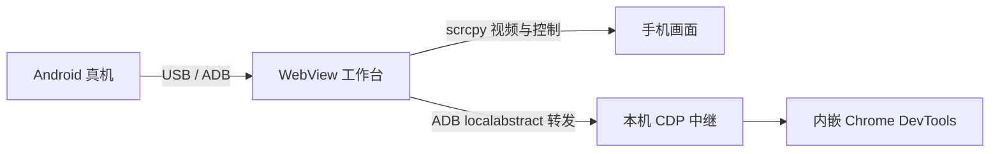

<p align="center">
  
</p>

<h1 align="center">WebView 工作台</h1>

<p align="center">连接 Android USB 真机，自动跟随当前 WebView，在一个 Windows 窗口中完成投屏、操作和 Chrome DevTools 调试。</p>

<p align="center">
  <a href="https://github.com/blueloveSeal/h5-andriod-webview/actions/workflows/ci.yml"></a>
  <a href="LICENSE"></a>
</p>

> 当前版本为 0.1.0，已在 Windows 10 22H2、Android 16、系统 WebView 143 上完成真实 USB 验证。Windows 11 和更多 Android/WebView 组合仍需要社区验证。

## 能做什么

- 发现已授权 USB 设备和设备上开放调试的 WebView 页面。
- 自动选择前台 APP 中唯一位于屏幕内的 WebView；可手动选择并锁定其他页面。
- 内嵌与目标 WebView 匹配的 DevTools，支持 Elements、Console、Sources、Network、Application、Performance 和 Memory。
- 在同一窗口显示手机实时画面，支持点击、拖动、键盘、文本、返回、主页和最近任务。
- 检测 CDP 断开和 DevTools 渲染进程异常，自动模式下按 1 秒、2 秒、4 秒最多重连 3 次。
- 显示 WebView、CDP、WebKit、DevTools 前端和 Electron Chromium 版本，并可复制不含设备序列号和本机端点的诊断信息。

## 工作方式



工作台只监听本机地址。设备返回的 DevTools 前端地址必须来自 Chrome 官方主机并带固定修订号；页面连接通过带随机令牌的本机 WebSocket 中继完成。

## 使用前准备

1. 使用 Windows x64，并安装 [Android SDK Platform-Tools](https://developer.android.com/tools/releases/platform-tools)。确保 `adb` 在 `PATH` 中，或启动后通过“配置 ADB”选择 `adb.exe`。
2. 在手机开发者选项中开启 USB 调试，用 USB 连接电脑，并在手机上接受这台电脑的 RSA 授权。
3. 自有 APP 必须在调试构建中开放 WebView 调试：

   ```kotlin
   if (BuildConfig.DEBUG) {
       WebView.setWebContentsDebuggingEnabled(true)
   }
   ```

4. 打开目标 APP，并进入需要调试的 WebView 页面。
5. 允许工作台访问 `chrome-devtools-frontend.appspot.com`。工具会加载目标设备指定修订版的 DevTools 前端资源。

不要在正式生产构建中无条件开启 WebView 调试。

## 安装和启动

带 `v*` 标签的版本由 GitHub Actions 生成 Windows x64 安装包。可从 [Releases](https://github.com/blueloveSeal/h5-andriod-webview/releases) 下载 `WebView-Workbench-<版本>-x64-Setup.exe`。如果 Releases 暂无安装包，请按“源码开发”部分构建。

当前社区构建未做 Windows 代码签名，Windows 可能显示未知发布者。安装程序支持选择安装目录，并创建桌面和开始菜单快捷方式。

启动后按以下顺序操作：

1. 在左栏选择已授权设备；设备只有一台时会自动选中。
2. 等待中间手机画面出帧和左栏 WebView 页面出现。
3. 前台 APP 只有一个屏幕内候选时，右侧 DevTools 会自动打开。
4. 需要调试预加载页或后台页时，点击对应页面进入“已锁定”；再次点击锁定状态恢复自动跟随。
5. 直接在手机画面上点击或拖动；先点画面获得焦点，再使用键盘。中文和多字符文本可通过下方输入栏发送。

## 自动跟随规则

工作台读取 Android 当前已恢复 Activity、WebView 所属进程和页面几何信息。只有同时属于前台 APP、位于屏幕内且候选唯一的页面才会自动打开。候选不唯一时保留当前选择，避免跳到预加载或后台页面。

手动选择页面会锁定当前目标，轮询不会抢回前台候选。目标消失后，工作台会选择新的唯一候选；没有唯一候选时保留可操作的页面列表供手动选择。

## 常见问题

| 现象 | 检查方式 |
| --- | --- |
| 找不到设备 | 运行 `adb devices -l`，确认状态为 `device`；重新插拔 USB 并接受手机授权。 |
| ADB 路径错误 | 点击“配置 ADB”，选择 Platform-Tools 目录中的 `adb.exe`。 |
| 能看到手机但没有 WebView | 确认 APP 当前页面包含 WebView，并且调试构建调用了 `setWebContentsDebuggingEnabled(true)`。 |
| 页面很多但没有自动打开 | 可能存在多个屏幕内候选或前台 Activity 信息不可读；在左栏手动选择并锁定。 |
| DevTools 空白或资源加载失败 | 检查是否能访问 `chrome-devtools-frontend.appspot.com`，再点击重新连接。 |
| DevTools 提示某个 CDP 方法不存在 | 目标 WebView 不支持该方法；可复制版本诊断用于反馈，其他面板通常仍可继续使用。 |
| 手机画面能看但不能控制 | 部分厂商需要额外开启“USB 调试（安全设置）”；受保护窗口也可能禁止投屏或输入。 |

## 源码开发

需要 Node.js 22.12.0 或更高版本、npm 和 Windows x64。依赖版本已锁定。

```powershell
git clone https://github.com/blueloveSeal/h5-andriod-webview.git
Set-Location h5-andriod-webview
npm ci
npm run dev
```

常用验证命令：

```powershell
npm test
npm run build
npm run smoke -- --webview
```

生成解包目录和 NSIS 安装包：

```powershell
npm run pack:win
npm run smoke:pack
npm run dist:win
```

`smoke:pack` 需要连接已授权真机，并提前打开含可调试 WebView 的 APP。安装包写入 `release/`；该目录被 Git 忽略。

## 项目边界

- DevTools 能力以目标 WebView 对 CDP 的实际支持为准。
- 原生页面通过投屏操作；原生网络请求不会出现在 WebView 的 Network 面板中。
- 多个 WebView 重叠、厂商系统限制和 `FLAG_SECURE` 窗口可能需要手动处理。
- ADB Server 由 Android Studio 等工具共享；退出工作台只清理自身创建的连接和转发，不执行全局 `adb kill-server`。

## 开源来源与许可

项目采用 [MIT License](LICENSE)。投屏服务端使用 [scrcpy 3.3.4](https://github.com/Genymobile/scrcpy/tree/v3.3.4)，Android 通信与客户端集成使用 [Tango / ya-webadb](https://github.com/yume-chan/ya-webadb)。详细版本和许可见 [THIRD_PARTY_NOTICES.md](THIRD_PARTY_NOTICES.md)。

贡献前请阅读 [CONTRIBUTING.md](CONTRIBUTING.md)。
